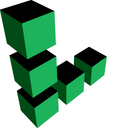

#  I'm [Gurvinder Singh](https://gurvindersingh.me) - aka [guriWiz](https://github.com/guriWiz) &nbsp;

    

  

    <a href="https://www.facebook.com/gurvindersingh.singh.792303/" target="_blank">
        &nbsp;
    </a>
    <a href="https://www.instagram.com/_guridev_/" target="_blank">
        &nbsp;
    </a>
    <a href="https://www.linkedin.com/in/gurvinder-singh-360691123/" target="_blank">
        &nbsp;
    </a>
    <a href="https://twitter.com/Guri_XD" target="_blank">
        &nbsp;
    </a>
    <a href="https://discordapp.com/users/GuriX#5028" target="_blank">
        &nbsp;
    </a>
    <a href="https://gurvindersingh.me" target="_blank">
        &nbsp;
    </a>
    

---

  

# 🖊️ About Me

- I'm a full stack developer with 4+ years of experience in building and breaking applications.
- I completed bachelor's and master's degree in computer applications.
- I'm on a journey to learn more about the AI/ML technologies, improve my skills, and keep gaining knowledge.
- I love the concept of **Open Source** because open source is about collaborating; not competing.
- Reach out to me for any guidance, collaboration or just an interesting discussion.
- If you found value in something that I have created, feel free to send some ❤️ my way.
- Fun fact: **ChatGPT** made me wrote this 🤖.

  

# 🌩️ Tech Stack

 

## Languages, Frameworks & Tools

&nbsp;&nbsp;&nbsp;&nbsp;
&nbsp;&nbsp;&nbsp;&nbsp;
&nbsp;&nbsp;&nbsp;&nbsp;
&nbsp;&nbsp;&nbsp;&nbsp;
&nbsp;&nbsp;&nbsp;&nbsp;
&nbsp;&nbsp;&nbsp;&nbsp;
&nbsp;&nbsp;&nbsp;&nbsp;
&nbsp;&nbsp;&nbsp;&nbsp;
&nbsp;&nbsp;&nbsp;&nbsp;
&nbsp;&nbsp;&nbsp;&nbsp;
&nbsp;&nbsp;&nbsp;&nbsp;
&nbsp;&nbsp;&nbsp;&nbsp;
&nbsp;&nbsp;&nbsp;&nbsp;
&nbsp;&nbsp;&nbsp;&nbsp;
&nbsp;&nbsp;&nbsp;&nbsp;
&nbsp;&nbsp;&nbsp;&nbsp;
&nbsp;&nbsp;&nbsp;&nbsp;
&nbsp;&nbsp;&nbsp;&nbsp;
&nbsp;&nbsp;&nbsp;&nbsp;
&nbsp;&nbsp;&nbsp;&nbsp;
&nbsp;&nbsp;&nbsp;&nbsp;
&nbsp;&nbsp;&nbsp;&nbsp;

 

## Softwares

&nbsp;&nbsp;&nbsp;&nbsp;
&nbsp;&nbsp;&nbsp;&nbsp;
&nbsp;&nbsp;&nbsp;&nbsp;

 

## Databases

&nbsp;&nbsp;&nbsp;&nbsp;
&nbsp;&nbsp;&nbsp;&nbsp;
&nbsp;&nbsp;&nbsp;&nbsp;
&nbsp;&nbsp;&nbsp;&nbsp;

 

## Cloud

&nbsp;
&nbsp;&nbsp;&nbsp;&nbsp;
&nbsp;&nbsp;&nbsp;&nbsp;
&nbsp;&nbsp;&nbsp;&nbsp;
&nbsp;&nbsp;&nbsp;&nbsp;

  

#  Github Stats

    

  

# 📌 My Holopins

